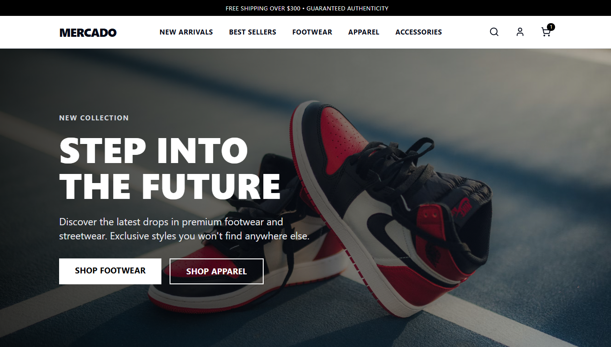

# Mercado Frontend

[](http://mercado-front-production.up.railway.app/)




## 🌐 Demo

Here is a working live demo: https://mercado-front-production.up.railway.app/

## 📝 Description

Mercado Frontend is a modern, responsive e-commerce platform designed to provide a seamless shopping experience. It serves as the frontend user interface for the [Mercado Ecommerce](https://github.com/janrizmlibres/mercado-ecommerce) backend project. It empowers users to browse products, manage their cart, and securely checkout. The platform also includes a robust admin dashboard for managing products and users. It is built with a focus on performance and type safety using React, Vite, TanStack Router, and GraphQL.

## 📖 Table of Contents

- [🌐 Demo](#-demo)
- [📝 Description](#-description)
- [✨ Features](#-features)
- [💻 Technologies Used](#-technologies-used)
- [🛠️ Setup Project](#-setup-project)
  - [🍴 Prerequisites](#-prerequisites)
  - [🚀 Install Project](#-install-project)
- [🤝 Contributing and Support](#-contributing-and-support)
  - [⚒️ How to Contribute](#️-how-to-contribute)
  - [📩 Bug Report](#-bug-report)
- [📞 Contact Me](#-contact-me)
- [📋 License](#-license)

## ✨ Features

👉 **Product Browsing**: Browse a comprehensive catalog of products with detailed views.

👉 **Collections**: Filter products by categories to find exactly what you need.

👉 **Shopping Cart**: Add items to cart, update quantities, and review your order.

👉 **Checkout Flow**: Streamlined process for purchasing items.

👉 **User Authentication**: Secure login and registration capabilities.

👉 **Admin Dashboard**: Dedicated area for administrators to manage products and users (Add Product, User List).

👉 **Responsive Design**: Fully responsive interface built with Tailwind CSS.

👉 **Type-Safe API**: Integrated with GraphQL for robust and type-safe data fetching.

## 💻 Technologies Used

- [![React.js][React.js]][React-url]
- [![TypeScript][TypeScript]][TypeScript-url]
- [![Vite][Vite]][Vite-url]
- [![TailwindCSS][TailwindCSS]][TailwindCSS-url]
- [![TanStack Router][TanStackRouter]][TanStackRouter-url]
- [![TanStack Query][TanStackQuery]][TanStackQuery-url]
- [![GraphQL][GraphQL]][GraphQL-url]

## 🛠️ Setup Project

To get this project up and running in your development environment, follow these step-by-step instructions.

### 🍴 Prerequisites

We need to install or make sure that these tools are pre-installed on your machine:

- [Node.js](https://nodejs.org/en)
- [npm](https://www.npmjs.com/) (Node Package Manager)

### 🚀 Install Project

1. Clone the Repository

```bash
git clone https://github.com/your-username/mercado-front.git
```

2. Install packages in the project directory

```bash
cd mercado-front
npm install
```

3. Configure Environment Variables

Create a `.env` file in the root directory and add the necessary environment variables (e.g., AUTH URL) according to backend.

```bash
VITE_GRAPHQL_URL="https://gateway-service/graphql"
VITE_UPLOADS_URL="https://uploads-service"
VITE_AUTH_URL="https://auth-service"
```

4. Run the development server

```bash
npm run dev
```

## 🤝 Contributing and Support

### ⚒️ How to Contribute

Want to contribute? Great!

To fix a bug or enhance an existing module, follow these steps:

- Fork the repo
- Create a new branch (`git checkout -b improve-feature`)
- Make the appropriate changes in the files
- Add changes to reflect the changes made
- Commit your changes (`git commit -am 'Improve feature'`)
- Push to the branch (`git push origin improve-feature`)
- Create a Pull Request

### 📩 Bug Report

If you find a bug, kindly open an issue [here](https://github.com/janrizmlibres/devflow-clone-app/issues/new) by including a description of your problem and the expected result.

## 📞 Contact Me

[
](https://www.linkedin.com/in/janrizlibres/)

## 📋 License

[MIT](https://choosealicense.com/licenses/mit/)
Released 2025 by Janriz Libres @janrizmlibres

[React.js]: https://img.shields.io/badge/react-%2320232a.svg?style=for-the-badge&logo=react&logoColor=%2361DAFB
[React-url]: https://react.dev/
[TypeScript]: https://img.shields.io/badge/typescript-%23007ACC.svg?style=for-the-badge&logo=typescript&logoColor=white
[TypeScript-url]: https://www.typescriptlang.org/
[Vite]: https://img.shields.io/badge/vite-%23646CFF.svg?style=for-the-badge&logo=vite&logoColor=white
[Vite-url]: https://vitejs.dev/
[TailwindCSS]: https://img.shields.io/badge/tailwindcss-%2338B2AC.svg?style=for-the-badge&logo=tailwind-css&logoColor=white
[TailwindCSS-url]: https://tailwindcss.com/
[TanStackRouter]: https://img.shields.io/badge/TanStack_Router-%23FF4154.svg?style=for-the-badge&logo=react-router&logoColor=white
[TanStackRouter-url]: https://tanstack.com/router/latest
[TanStackQuery]: https://img.shields.io/badge/TanStack_Query-%23FF4154.svg?style=for-the-badge&logo=react-query&logoColor=white
[TanStackQuery-url]: https://tanstack.com/query/latest
[GraphQL]: https://img.shields.io/badge/-GraphQL-E10098?style=for-the-badge&logo=graphql&logoColor=white
[GraphQL-url]: https://graphql.org/
